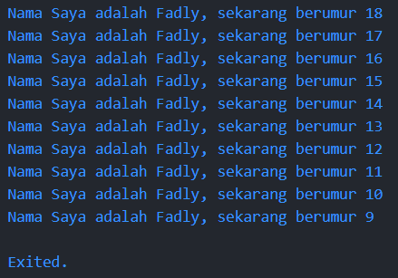

## Laporan Hasil Praktikum
## Pemograman Mobile
## Pertemuan 2

<hr>

### Nama  : Fadly Nugraha Jati
### NIM   : 2241720149
### Absen : 12
### Kelas : TI-3G

<hr>

### Soal 1

Source code:

```dart
void main() {
  for (var i = 18; i >= 9; i--) {
    print('Nama Saya adalah Fadly, sekarang berumur $i');
  }
}
```

Hasil output:



### Soal 2

Flutter adalah framework untuk membangun aplikasi cross platform yang menggunakan Dart sebagai bahasa pemrogramannya. Mengetahui Dart secara mendalam memungkinkan untuk menulis kode yang efektif dan efisien dalam Flutter. Tanpa pemahaman yang baik tentang Dart, akan mengalami kesulitan dengan sintaks, struktur, dan fitur bahasa yang digunakan dalam Flutter.

### Soal 3

1. Fitur Bahasa Dart:

    -  Tooling Produktif: Dart menyediakan alat analisis kode, plugin IDE, dan ekosistem paket yang besar.
    - Garbage Collection: Mengelola alokasi dan dealokasi memori secara otomatis.
    - Type Annotations (Opsional): Menawarkan keamanan dan konsistensi data, meskipun tipe data dapat dideklarasikan secara opsional.
    - Type-Safe dan Statically Typed: Memastikan keamanan tipe data dan menemukan bug saat kompilasi.
    - Portabilitas: Kode Dart dapat dikompilasi ke JavaScript untuk web dan ke kode mesin ARM serta x86 untuk aplikasi native.

2. Evolusi Dart:

    - Awalnya fokus pada pengembangan web, sekarang lebih fokus pada pengembangan mobile terutama dengan Flutter.
    - Menyediakan performa yang baik dan alat modern untuk proyek besar.
    - Menyediakan fleksibilitas dan ketangguhan melalui fitur seperti type annotations opsional dan OOP.

3. Dart VM dan Kompilasi:

    - Kompilasi JIT (Just-In-Time): Digunakan selama pengembangan untuk debugging dan hot reload.
    - Kompilasi AOT (Ahead-Of-Time): Digunakan untuk aplikasi produksi untuk kinerja yang lebih baik.

4. Konsep Dasar Dart:

    - Object-Oriented: Dart mendukung prinsip-prinsip OOP seperti encapsulation, inheritance, composition, abstraction, dan polymorphism.
    - Operator Dart: Operasi aritmatika, perbandingan, logika, dan operator inkremen/dekremen yang mirip dengan bahasa lain namun dengan fitur khusus.

5. Sintaks Dasar Dart:

    - Function main: Titik masuk aplikasi Dart yang harus ada dalam setiap program.
    - Function vs Method: Function berdiri sendiri, sementara method adalah bagian dari kelas dan menggunakan referensi this.

6. Penggunaan DartPad:

    - DartPad adalah alat online untuk menulis dan menjalankan kode Dart dengan mudah, ideal untuk eksperimen dan pembelajaran.