## Laporan Hasil Praktikum
## Pemograman Mobile
## Pertemuan 3

<hr>

### Nama  : Fadly Nugraha Jati
### NIM   : 2241720149
### Absen : 12
### Kelas : TI-3G

<hr>

### Praktikum 1

1. Ketik atau salin kode program berikut ke dalam fungsi main().

```dart
String test = "test2";
if (test == "test1") {
   print("Test1");
} else If (test == "test2") {
   print("Test2");
} Else {
   print("Something else");
}

if (test == "test2") print("Test2 again");
```

2. Silakan coba eksekusi (Run) kode pada langkah 1 tersebut. Apa yang terjadi? Jelaskan!

Terjadi error dengan pesan sebagai berikut:

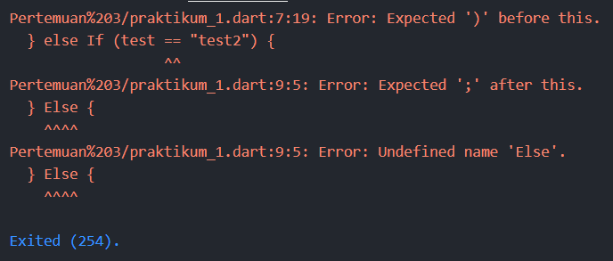

Berikut adalah perbaikan kode agar bisa di-run:

```dart
void main() {
   String test = "test2";

   if (test == "test1") {
      print("Test1");
   } else if (test == "test2") {
      print("Test2");
   } else {
      print("Something else");
   }

   if (test == "test2") print("Test2 again");
}
```

Output ketika kode program di-run:

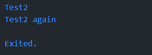

3. Tambahkan kode program berikut, lalu coba eksekusi (Run) kode Anda.

```dart
String test = "true";
if (test) {
   print("Kebenaran");
}
```

Apa yang terjadi ? Jika terjadi error, silakan perbaiki namun tetap menggunakan if/else.

Terjadi error dengan pesan sebagai berikut:

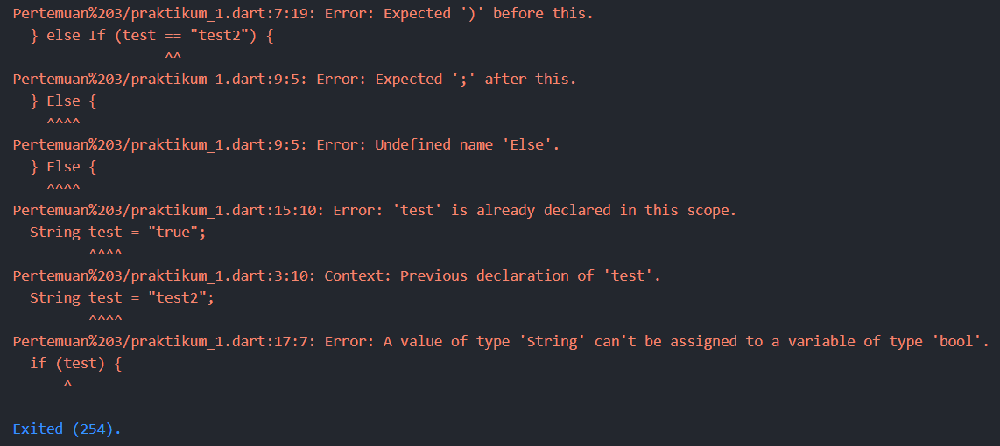

Berikut adalah perbaikan kode agar bisa di-run:

```dart
void main() {
   String test = "test2";

   if (test == "test1") {
      print("Test1");
   } else if (test == "test2") {
      print("Test2");
   } else {
      print("Something else");
   }

   if (test == "test2") print("Test2 again");
  
   test = "true";

   if (test) {
      print("Kebenaran");
   }
}
```

Output ketika kode program di-run:

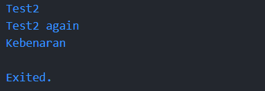

### Praktikum 2

1. Ketik atau salin kode program berikut ke dalam fungsi main().

```dart
while (counter < 33) {
  print(counter);
  counter++;
}
```

2. Silakan coba eksekusi (Run) kode pada langkah 1 tersebut. Apa yang terjadi? Jelaskan! Lalu perbaiki jika terjadi error.

Terjadi error dengan pesan sebagai berikut:

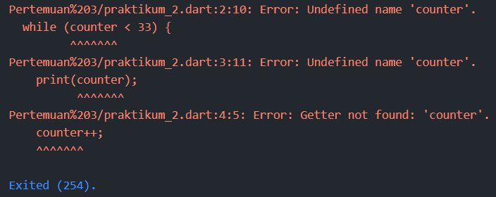

Error tersebut terjadi karena variabel 'counter' belum terdefinisi dan diakses oleh program.

Perbaikan kode program:

```dart
void main() {
  int counter = 0;

  while (counter < 33) {
    print(counter);
    counter++;
  }
}
```

Output kode program:


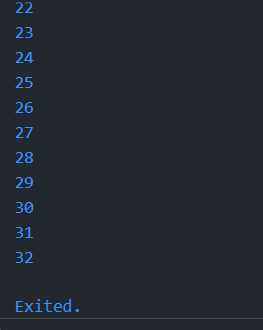

3. Tambahkan kode program berikut, lalu coba eksekusi (Run) kode Anda.

```dart
do {
  print(counter);
  counter++;
} while (counter < 77);
```

Apa yang terjadi ? Jika terjadi error, silakan perbaiki namun tetap menggunakan do-while.

Program berjalan tanpa error dan output yang dihasilkan telah sesuai.

Output program:

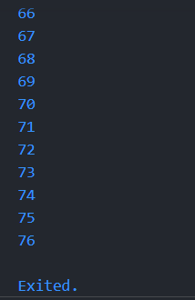

### Praktikum 3

1. Ketik atau salin kode program berikut ke dalam fungsi main().

```dart
for (Index = 10; index < 27; index) {
  print(Index);
}
```

2. Silakan coba eksekusi (Run) kode pada langkah 1 tersebut. Apa yang terjadi? Jelaskan! Lalu perbaiki jika terjadi error.

Terjadi error dengan pesan sebagai berikut:

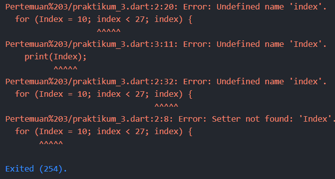

Error terjadi karena variabel 'index' belum terdefinisi dengan tipe data dan dikarenakan Dart merupakan bahasa pemograman yang case sensitive, typo yang terjadi pada penulisan variabel akan menyebabkan error. Selain itu, pada looping yang dilakukan variabel 'index' tidak dilakukan increment atau decrement sehingga dapat menyebabkan infinite loop.

Perbaikan kode program:

```dart
void main() {
  for (int index = 10; index < 27; index++) {
    print(index);
  }
}
```

Output program:


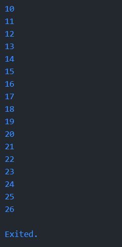

3. Tambahkan kode program berikut di dalam for-loop, lalu coba eksekusi (Run) kode Anda.

```dart
If (Index == 21) break;
Else If (index > 1 || index < 7) continue;
print(index);
```

Apa yang terjadi ? Jika terjadi error, silakan perbaiki namun tetap menggunakan for dan break-continue.

Pesan error sebagai berikut:

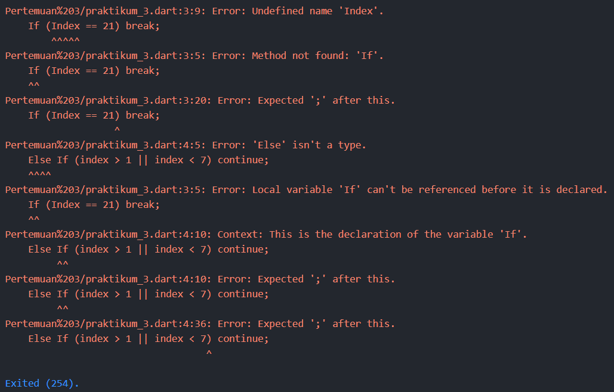

Error terjadi karena kesalahan penulisan syntax, dan juga karena typo pada penulisan variabel.

Perbaikan kode program:

```dart
void main() {
  for (int index = 10; index < 27; index++) {
    if (index == 21) break;
    else if (index > 1 || index < 7) continue;
    print(index);
  }
}

```

Output program:


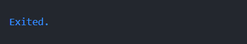

Pada looping yang dilakukan kondisi pada if else akan selalu terpenuhi sehingga loop akan di-continue secara terus menerus atau di-break tanpa melakukan print.

### Tugas

Kode program:

```dart
void main() {
  for (var number = 0; number <= 201; number++) {
    if (number <= 1) {
      print(number);
      continue;
    }

    if (number == 2) {
      print('Fadly Nugraha Jati 2241720149');
      continue;
    }

    if (number % 2 == 0) {
      print(number);
      continue;
    }

    bool isPrime = true;

    for (int i = 3; i * i <= number; i += 2) {
      if (number % i == 0) {
        isPrime = false;
        break;
      }
    }

    if (isPrime) {
      print('Fadly Nugraha Jati 2241720149');
    } else {
      print(number);
    }
  }
}
```

Output program:

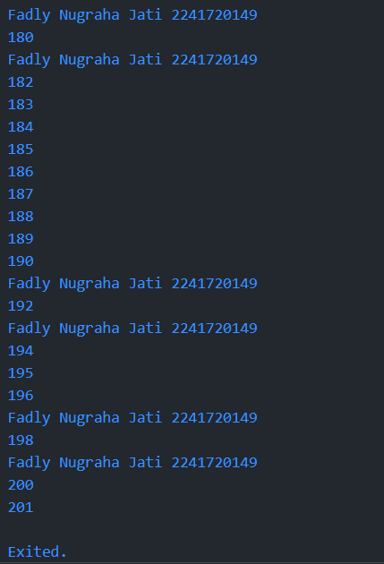