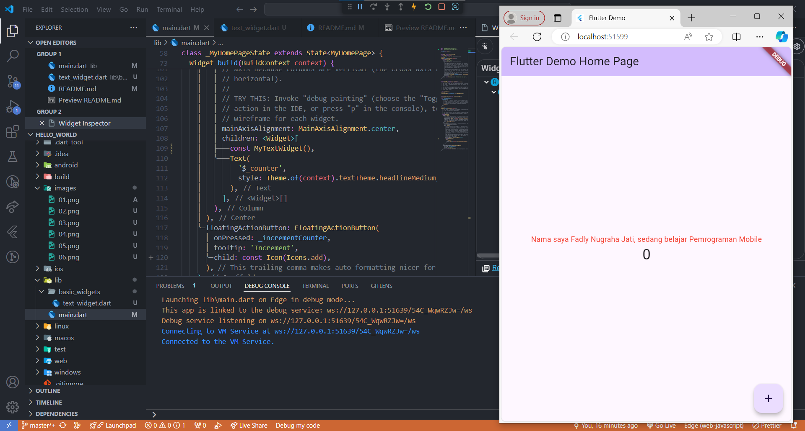

## Laporan Hasil Praktikum
## Pemograman Mobile
## Pertemuan 5

### Nama  : Fadly Nugraha Jati
### NIM   : 2241720149
### Absen : 12
### Kelas : TI-3G

## Tugas Praktikum

1. Selesaikan Praktikum 1 sampai 5, lalu dokumentasikan dan push ke repository Anda berupa screenshot setiap hasil pekerjaan beserta penjelasannya di file README.md!

    #### Link Repository: https://github.com/fadlynj/flutter-fundamental-part1

    #### Screenshot Program:

    #### Praktikum 1

    

    

    

    

    

    #### Praktikum 2
    
    

    #### Praktikum 3

    

    #### Praktikum 4

    

    

    #### Praktikum 5

    

    

    

    

    

    

    

    
    

2. Selesaikan Praktikum 2 dan Anda wajib menjalankan aplikasi hello_world pada perangkat fisik (device Android/iOS) agar Anda mempunyai pengalaman untuk menghubungkan ke perangkat fisik. Capture hasil aplikasi di perangkat, lalu buatlah laporan praktikum pada file README.md.

    

3. Pada praktikum 5 mulai dari Langkah 3 sampai 6, buatlah file widget tersendiri di folder basic_widgets, kemudian pada file main.dart cukup melakukan import widget sesuai masing-masing langkah tersebut!

    

4. Selesaikan Codelabs: Your first Flutter app, lalu buatlah laporan praktikumnya dan push ke repository GitHub Anda!

    #### Link Repository: https://github.com/fadlynj/namer_app

    #### Screenshot Program:

    #### Add a button

    

    

    

    

    #### Make the app prettier

    

    

    

    

    

    

    #### Add functionality

    

    

    

    

    #### Add navigation rail

    

    

    

    

    

    #### Add a new page

    

    

    

    

    

    

5. README.md berisi: capture hasil akhir tiap praktikum (side-by-side, bisa juga berupa file GIF agar terlihat proses perubahan ketika ada aksi dari pengguna) dengan menampilkan NIM dan Nama Anda sebagai ciri pekerjaan Anda.

6. Kumpulkan berupa link repository/commit GitHub Anda kepada dosen yang telah disepakati!