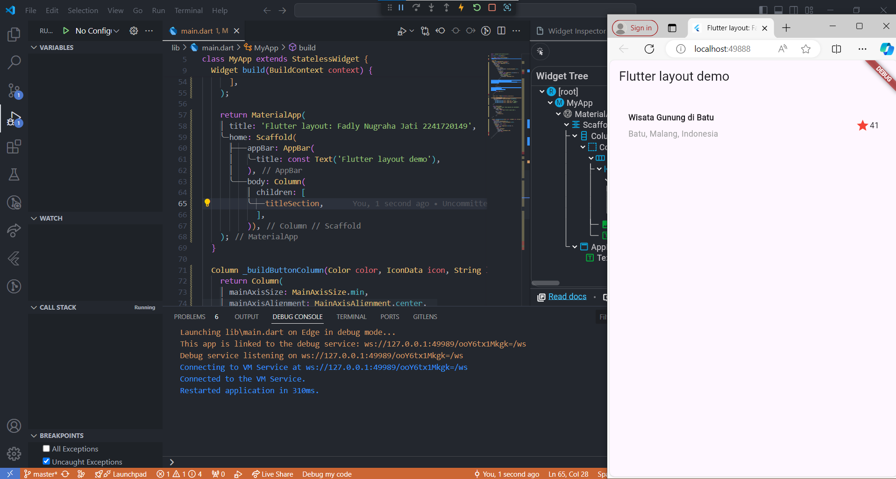
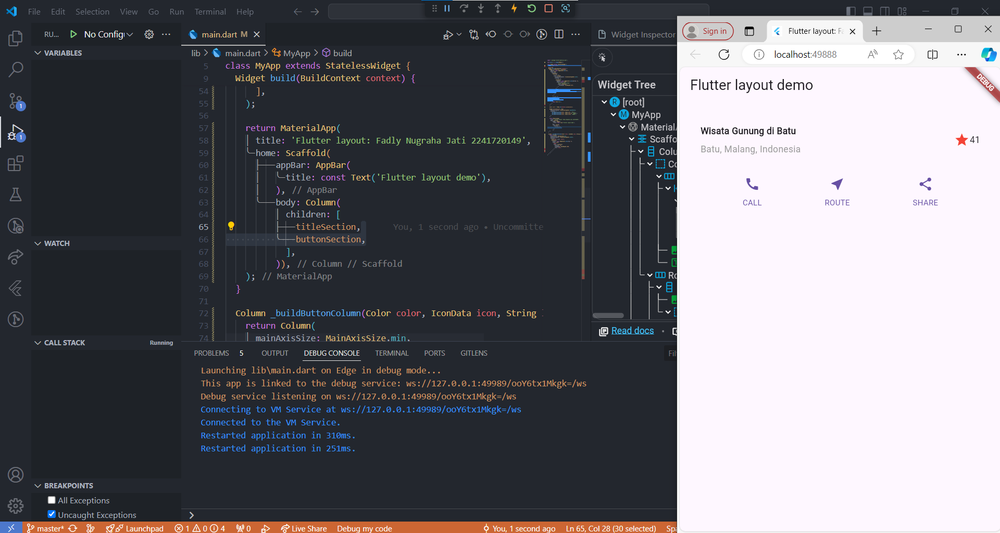
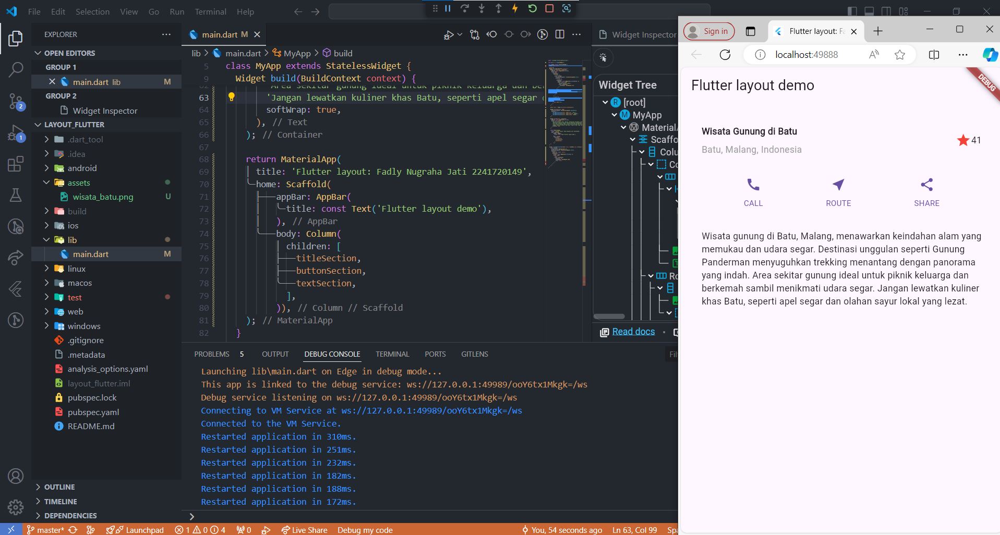
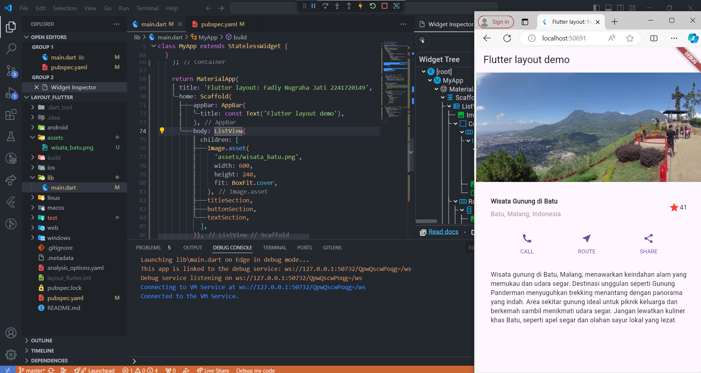
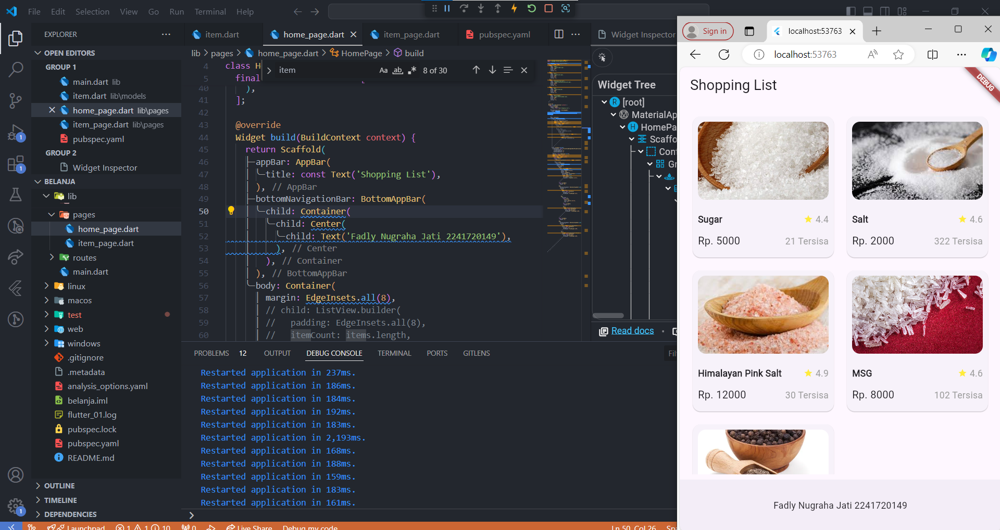
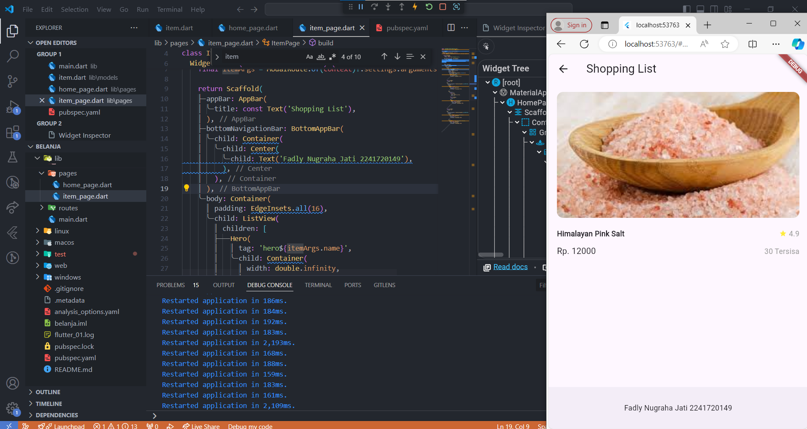
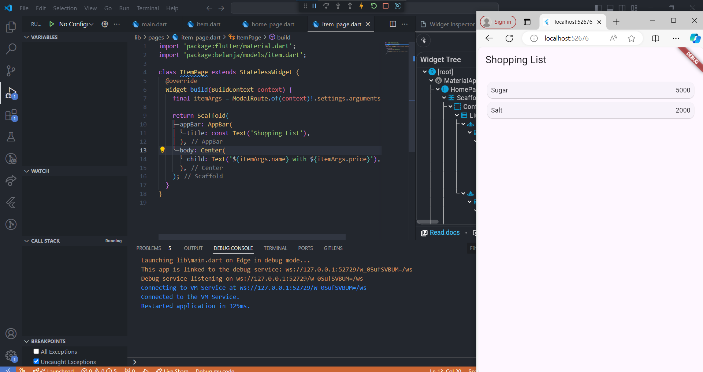
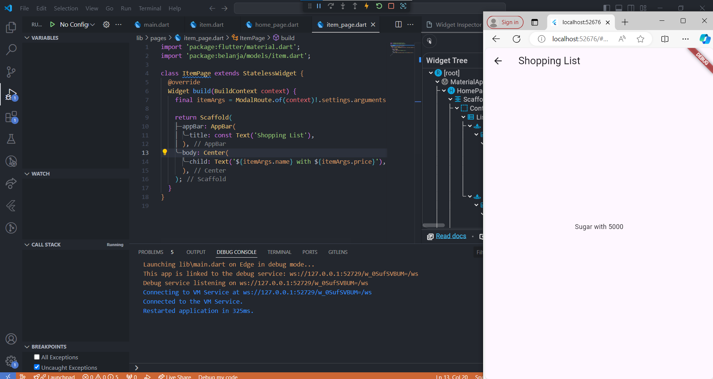

## Laporan Hasil Praktikum
## Pemograman Mobile
## Pertemuan 6

<hr>

### Nama  : Fadly Nugraha Jati
### NIM   : 2241720149
### Absen : 12
### Kelas : TI-3G

<hr>

## Tugas Praktikum 1

1. Selesaikan Praktikum 1 sampai 4, lalu dokumentasikan dan push ke repository Anda berupa screenshot setiap hasil pekerjaan beserta penjelasannya di file README.md!

    ### Link Repository: https://github.com/fadlynj/layout_flutter

    ### Praktikum 1

    

#### Soal Praktikum 1

1. Letakkan widget Column di dalam widget Expanded agar menyesuaikan ruang yang tersisa di dalam widget Row. Tambahkan properti crossAxisAlignment ke CrossAxisAlignment.start sehingga posisi kolom berada di awal baris.

    ```dart
                child: Column(
                  crossAxisAlignment: CrossAxisAlignment.start,
                  children: [
                  ...
                  ],
                ),

    ```

2. Letakkan baris pertama teks di dalam Container sehingga memungkinkan Anda untuk menambahkan padding = 8. Teks ‘Batu, Malang, Indonesia' di dalam Column, set warna menjadi abu-abu.

    ```dart
                    Container(
                      padding: const EdgeInsets.only(bottom: 8),
                      child: const Text(
                        'Wisata Gunung di Batu',
                        style: TextStyle(
                          fontWeight: FontWeight.bold,
                        ),
                      ),
                    ),
                    Text(
                      'Batu, Malang, Indonesia',
                      style: TextStyle(color: Colors.grey),
                    ),
    ```

3. Dua item terakhir di baris judul adalah ikon bintang, set dengan warna merah, dan teks "41". Seluruh baris ada di dalam Container dan beri padding di sepanjang setiap tepinya sebesar 32 piksel. Kemudian ganti isi body text ‘Hello World' dengan variabel titleSection seperti berikut:

    ```dart
              Icon(
                Icons.star,
                color: Colors.red,
              ),
              const Text('41'),
    ```

    ### Praktikum 2

    

    ### Praktikum 3

    

    ### Praktikum 4

    

2. Silakan implementasikan di project baru "basic_layout_flutter" dengan mengakses sumber ini: https://docs.flutter.dev/codelabs/layout-basics

3. Kumpulkan link commit repository GitHub Anda kepada dosen yang telah disepakati!

## Tugas Praktikum 2

1. Untuk melakukan pengiriman data ke halaman berikutnya, cukup menambahkan informasi arguments pada penggunaan Navigator. Perbarui kode pada bagian Navigator menjadi seperti berikut.

```dart
Navigator.pushNamed(context, '/item', arguments: item);
```

2. Pembacaan nilai yang dikirimkan pada halaman sebelumnya dapat dilakukan menggunakan ModalRoute. Tambahkan kode berikut pada blok fungsi build dalam halaman ItemPage. Setelah nilai didapatkan, anda dapat menggunakannya seperti penggunaan variabel pada umumnya. (https://docs.flutter.dev/cookbook/navigation/navigate-with-arguments)

```dart
final itemArgs = ModalRoute.of(context)!.settings.arguments as Item;
```

3. Pada hasil akhir dari aplikasi belanja yang telah anda selesaikan, tambahkan atribut foto produk, stok, dan rating. Ubahlah tampilan menjadi GridView seperti di aplikasi marketplace pada umumnya.

    

4. Silakan implementasikan Hero widget pada aplikasi belanja Anda dengan mempelajari dari sumber ini: https://docs.flutter.dev/cookbook/navigation/hero-animations

    

5. Sesuaikan dan modifikasi tampilan sehingga menjadi aplikasi yang menarik. Selain itu, pecah widget menjadi kode yang lebih kecil. Tambahkan Nama dan NIM di footer aplikasi belanja Anda.

6. Selesaikan Praktikum 5: Navigasi dan Rute tersebut. Cobalah modifikasi menggunakan plugin go_router, lalu dokumentasikan dan push ke repository Anda berupa screenshot setiap hasil pekerjaan beserta penjelasannya di file README.md. Kumpulkan link commit repository GitHub Anda kepada dosen yang telah disepakati!

    ### Link Repository: https://github.com/fadlynj/belanja

    ### Praktikum 5

    

    
